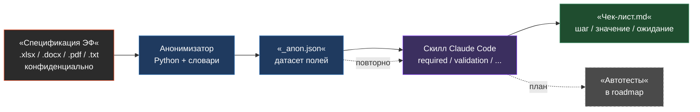

# QA-Ассистент: Анонимизированный генератор чек-листов


> Конвейер, который обезличивает конфиденциальные спецификации электронных форм страхового B2B и превращает их в готовые чек-листы для ручного тестирования — безопасно для передачи в AI-инструменты и без рутины «скопируй-вычисти-напиши руками».

Полное описание проекта — в [`reports/Diplom Project/project-card.md`](reports/Diplom%20Project/project-card.md).

---

## Идея

В страховом B2B описания полей электронных форм (ЭФ) приходят как Excel-таблицы с ФИО, банками, страховыми компаниями, продуктами. Передавать их наружу в AI-инструменты нельзя, а обезличивать и писать чек-листы руками по каждой доработке — долго и чревато ошибками.

Проект делит систему на **два независимых слоя**:

- **Слой данных (стабильный)** — Excel/документ → анонимизатор → JSON-датасет полей.
- **Слой генерации (меняется часто)** — JSON-датасет → скилл → чек-листы (сейчас) / автотесты (потом).

Спецификации меняются редко, промпты — часто. Перегонка того же JSON через новый скилл идёт **без переразбора исходного Excel**.

## Как это работает



Слева — конфиденциальный вход, который **никогда** не покидает локальную машину в исходном виде. Справа — Markdown-чек-листы, безопасные для публикации и прогона.

## Возможности

**Анонимизатор (`tools/anonymize/`)**
- Извлечение текста и изображений из `.xlsx`, `.docx`, `.pdf`, `.txt`.
- Замена ПД и сущностей на структурированные псевдонимы (`PERSON_0001`, `BANK_0001`, `INS_0001`, `PRODUCT_0011`) с **устойчивым маппингом** между запусками.
- Извлечение структуры полей ЭФ в канонический JSON-датасет: параметры, блоки, статусы `required` / `default` / `hidden`, source-координаты.
- Омоглиф-фикс латиницы→кириллицы (лечит «Cогласие-Вита» → «Согласие-Вита»).
- Review-механизм: подозрительные совпадения, не ставшие псевдонимом, флагуются в отдельный файл для ручного разбора.
- GUI на Tkinter с предпросмотром «до/после» и панелью ревью.

**Скиллы (`.claude/skills/`)**
- Атомарные чек-листы по аспектам: обязательность, дефолты, доступность, валидация, полное покрытие.
- Принимают JSON-датасет анонимизатора (не Excel напрямую) — зависят от стабильного слоя данных.
- Маршрутизация запроса к нужному скиллу через агента `router`.

## Быстрый старт

```bash
# 1. Клонировать и поставить зависимости
git clone https://github.com/MikhaiMedvedevQA/QA_Vibe-coding.git
cd QA_Vibe-coding
python -m venv .venv && source .venv/Scripts/activate   # Windows, Git Bash
pip install -r tools/anonymize/requirements.txt

# 2. Подготовить словари (один раз) — скопировать шаблоны в реальные имена
cd tools/anonymize
for f in persons banks insurance products orgs ignore; do
  cp "dictionaries/$f.example.txt" "dictionaries/$f.txt"
done
cp mapping.example.json mapping.json
cd ../..

# 3. Анонимизировать спецификацию и получить JSON-датасет
python tools/anonymize/anonymize.py path/to/spec.xlsx
# → anonimized/spec_anon.md + spec_anon.json

# 4. Сгенерировать чек-лист в Claude Code, подав spec_anon.json нужному скиллу
```

## Структура проекта

```
.
├── tools/
│   ├── anonymize/            # слой данных: анонимизатор (Python)
│   │   ├── anonymize.py      # CLI: python tools/anonymize/anonymize.py <файл|папка>
│   │   ├── extractors.py     # извлечение текста/изображений из pdf/docx/xlsx/txt
│   │   ├── spec_extractor.py # извлечение структуры полей ЭФ в JSON-датасет
│   │   ├── detectors.py      # детекторы сущностей, омоглиф-фикс, review-кандидаты
│   │   ├── writers.py        # запись вывода, сборка review-файла
│   │   ├── mapper.py         # устойчивый маппинг «оригинал → псевдоним»
│   │   ├── config.py         # типы сущностей, справочники, форматы псевдонимов
│   │   ├── mapping.example.json  # пустой шаблон маппинга (реальный mapping.json в .gitignore)
│   │   ├── dictionaries/     # словари сущностей: *.example.txt — шаблоны, *.txt — локально
│   │   └── tests/            # pytest-кейсы (detectors, review-candidates)
│   └── anonymize_gui/        # десктоп-GUI на Tkinter
│       └── app.py            # python tools/anonymize_gui/app.py
├── .claude/
│   ├── agents/               # субагенты: router, qa-assistant, python-coder, learn-assistant
│   └── skills/               # скиллы генерации чек-листов и вспомогательные (см. таблицу)
├── templates/
│   └── test-case/             # образцы стиля чек-листов (Кейсы.xlsx и др.)
├── README.md                  # этот файл (главная страница репозитория)
├── CLAUDE.md                  # инструкции проекту и описание агентов/скиллов
└── reports/Diplom Project/    # документы дипломного проекта
    └── project-card.md        # структурное описание проекта
```

## Установка

Требуется Python 3.11+. Для legacy `.doc` дополнительно нужен внешний бинарник [pandoc](https://pandoc.org/installing.html).

```bash
python -m venv .venv
source .venv/Scripts/activate   # Windows, Git Bash; на Linux/macOS — source .venv/bin/activate
pip install -r tools/anonymize/requirements.txt
```

Зависимости: `PyMuPDF`, `python-docx`, `openpyxl`, `pytest`. GUI использует встроенный `tkinter`.

### Словари и маппинг (первая настройка)

Анонимизатор ищет сущности по словарям в `tools/anonymize/dictionaries/` и хранит глобальный маппинг в `tools/anonymize/mapping.json`. Реальные словари и `mapping.json` содержат сущности практики и **в репозиторий не попадают** (см. `.gitignore` и раздел «Конфиденциальность»). В репозитории лежат только `.example`-шаблоны.

Перед первым запуском скопируйте шаблоны в реальные имена и заполните своими данными:

```bash
cd tools/anonymize
for f in persons banks insurance products orgs ignore; do
  cp "dictionaries/$f.example.txt" "dictionaries/$f.txt"
done
cp mapping.example.json mapping.json
```

Пустые словари допустимы — детекторы сущностей работают и по эвристике (контекстным ключам), словари лишь расширяют ловлю известных названий. `mapping.json` заполняется автоматически при первом прогоне и дозаписывается при следующих.

## Запуск анонимизатора

### CLI

```bash
python tools/anonymize/anonymize.py <входной_файл_или_папка> [--out DIR] [--mapping FILE] [--reset-mapping]
```

| Параметр           | Назначение                                                                 |
|--------------------|----------------------------------------------------------------------------|
| `input`            | Файл или папка (поддерживаются `.xlsx`, `.pdf`, `.docx`, `.doc`, `.txt`).   |
| `--out`            | Каталог вывода (по умолчанию `anonimized/` рядом с исходником).             |
| `--mapping`        | Путь к файлу маппинга (по умолчанию `tools/anonymize/mapping.json`).        |
| `--reset-mapping`  | Начать с чистого маппинга (нарушает консистентность псевдонимов).          |

Результаты в папке вывода:
- `<stem>_anon.md` — обезличенный текст.
- `<stem>_anon.json` — JSON-датасет структуры полей ЭФ (только для `.xlsx`).
- `<stem>_anon_review.json` — кандидаты на ручной разбор (подозрительные совпадения).
- `<stem>_anon_assets/` — вынесенные изображения с манифестом `index.json`.
- `index.json` — сводный индекс по всем обработанным документам.

### GUI

```bash
python tools/anonymize_gui/app.py
```

Выбор файла → анонимизация с предпросмотром «до/после» (псевдонимы подсвечены) → сохранение результата рядом с исходником. Панель ревью — разбор кандидатов и кнопка «В ignore.txt».

## Генерация чек-листов (слоем скиллов)

Скиллы работают в Claude Code и принимают на вход JSON-датасет анонимизатора (не Excel напрямую) + опционально текстовое ТЗ:

1. Прогнать анонимизатор по Excel-спецификации → получить `<stem>_anon.json`.
2. В Claude Code вызвать нужный скилл через агента `router` (или напрямую).
3. На выходе — Markdown-чек-лист (один на ЭФ, табличная форма: шаг / значение / ожидаемый результат).

| Скилл                       | Что проверяет                                                    | Вход                       |
|-----------------------------|------------------------------------------------------------------|----------------------------|
| `required-fields`           | обязательность полей (всегда/условно), поведение при пустых      | JSON достаточно            |
| `default-values-checklist`  | предустановленные значения при открытии/создании                | JSON достаточно            |
| `field-availability`        | видимость / активность / очистка / кнопки и блоки                | JSON достаточно            |
| `validation-positive`       | позитивная валидация форматов                                    | JSON + опц. текстовое ТЗ   |
| `validation-negative`       | негативная валидация, граничные значения                        | JSON + опц. текстовое ТЗ   |
| `validation-full`           | полная валидация                                                 | JSON + опц. текстовое ТЗ   |
| `qa-full-coverage`          | полное покрытие (v1)                                            | JSON + опц. текстовое ТЗ   |
| `qa-full-coverage-v2`        | полное покрытие (v2)                                            | JSON + опц. текстовое ТЗ   |
| `qa-generate-test-cases`    | тест-кейсы из User Story                                         | текстовое ТЗ               |
| `test-analysis`             | анализ результатов прогона                                       | данные прогона             |
| `op-scope`                  | разбор ОП в скоуп тестирования                                   | текстовое ОП               |

Вспомогательные: `qa-essay-structured` / `qa-essay-free` (эссе-самопрезентация Manual QA), `learn/explain-topic` (конспекты), `python/create-test-template` (шаблоны автотестов), `shared/naming-conventions`, `router/routing-decision`.

## Тесты

```bash
cd tools/anonymize
python -m pytest
```

Покрытие: детекторы сущностей, омоглиф-фикс, review-кандидаты (23 кейса модуля review).

## Конфиденциальность

Проект обрабатывает требования страхового B2B, которые содержат ПД и коммерческую тайну. В публичный репозиторий намеренно не попадают:

- `tools/anonymize/dictionaries/*.txt` (кроме `.example`) — реальные названия банков, страховых компаний, продуктов, организаций, ФИО. В репо лежат только `*.example.txt`-шаблоны с вымышленными примерами.
- `tools/anonymize/mapping.json` — накопленный маппинг «оригинал → псевдоним» (по нему восстанавливаются исходные сущности). В репо лежит пустой `mapping.example.json`.
- `work/`, `references/`, `learn/` — рабочие и учебные материалы.
- `reports/*` (кроме `Diplom Project/`) — рабочие отчёты.
- `.claude/plans/`, `.claude/settings.local.json`, `.claude/mcp.json`, `.mcp.json`, `.env`, `.idea/` — локальные настройки, секреты, среда.
- Результаты прогонов: `anonimized/`, `*_anon.md`, `*_anon.json`, `*_anon_review.json`, `*_anon_assets/` — обезличенные выходы и ассеты.

Полный список — в `.gitignore` в корне репозитория.

## Дорожная карта

- [x] Анонимизатор: извлечение, замена сущностей, устойчивый маппинг, JSON-датасет, review-механизм, омоглиф-фикс, GUI.
- [x] Скиллы: чек-листы по обязательности, дефолтам, доступности, валидации, полному покрытию.
- [x] Агенты: `router` + `qa-assistant` + `python-coder` + `learn-assistant`.
- [x] Тесты: pytest-кейсы на детекторы и review-механизм.
- [ ] Генерация автотестов на Python (Selenium + pytest + Allure) из того же JSON-датасета.
- [ ] Сравнение версий спецификаций как diff двух JSON.
- [ ] MCP-подключения: Jira, Яндекс.Диск, Telegram-бот.

## Технологии

- **Язык:** Python (слой данных); промпты/скиллы на естественном языке (Claude Code).
- **Библиотеки:** PyMuPDF, python-docx, openpyxl, pandoc, pytest.
- **Платформа:** Claude Code (субагенты, скиллы, маршрутизация).
- **Форматы:** вход — `.xlsx`/`.docx`/`.pdf`/`.txt`; промежуточный — `.json`; выход — `.md`.

## Как создавался проект

Этот проект сделан методом **vibe-кодинга** с [Claude Code](https://claude.com/claude-code): человек задаёт направление, формулирует требования и ревьюит результат, а агент пишет код анонимизатора, проектирует скиллы и ведёт архитектурные решения. Так родилась ключевая идея — разделить стабильный слой данных (Excel → JSON) и часто меняющийся слой генерации (JSON → скиллы → чек-листы): спецификации перепарсить один раз, а промпты можно менять свободно. Архитектурные компромиссы зафиксированы в памяти проекта и обоснованы в коде.

## Автор

Михаил — QA-инженер ручного тестирования B2B/B2C-продуктов страховой компании. Дипломный проект курса автоматизации тестирования на Python.